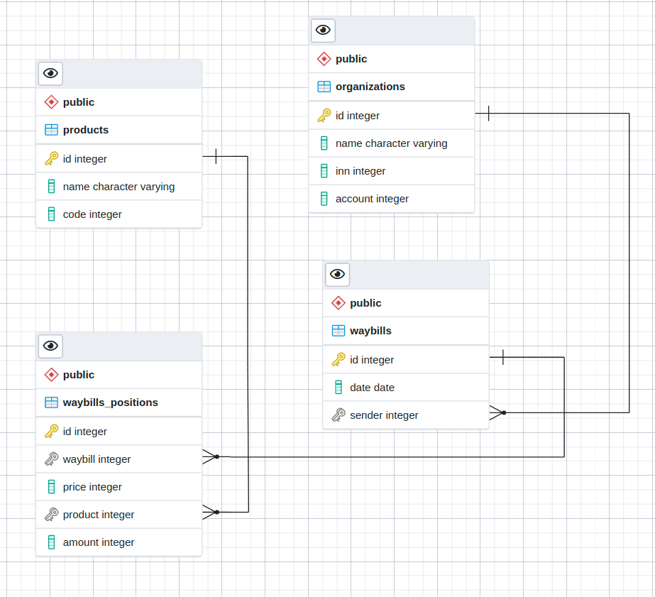

### Запросы на построение отчетов:
Query1: Выбрать первые 10 поставщиков по количеству поставленного товара  
Query2: Выбрать поставщиков с суммой поставленного товара выше указанного количества (товар и его количество должны допускать множественное указание).  
Query3: За каждый день для каждого товара рассчитать количество и сумму полученного товара в указанном периоде, посчитать итоги за период.  
Query4: Рассчитать среднюю цену полученного товара за период.  
Query5: Вывести список товаров, поставленных организациями за период. Если организация товары не поставляла, то она все равно должна быть отражена в списке.

